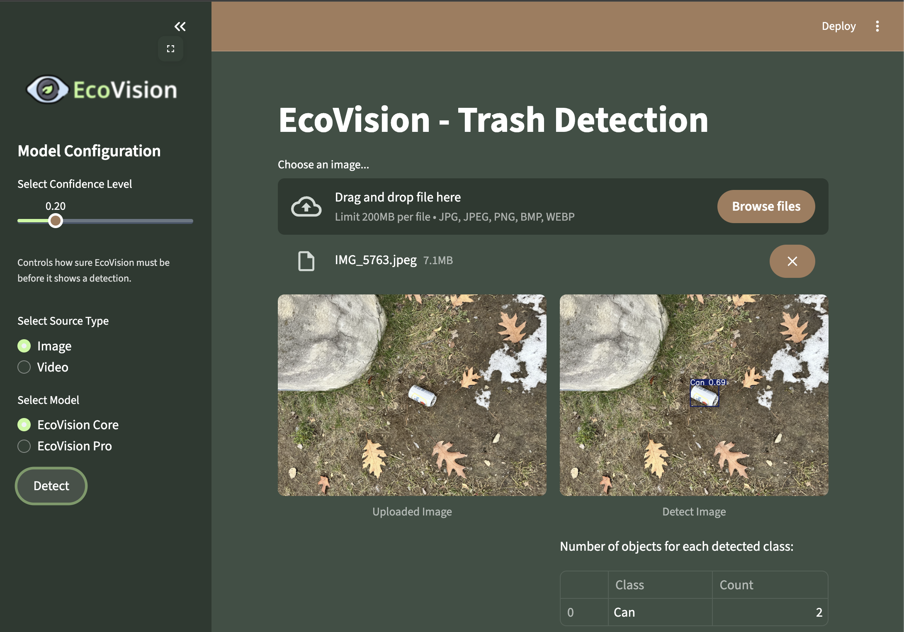

# EcoVision

**Campus Trash Detection using YOLOv10**

A computer vision system that detects and classifies trash in images and videos, built for CS366 Computer Vision at Colby College.



## Overview

EcoVision uses a fine-tuned YOLOv10 model to detect common waste items including cardboard, glass, metal, paper, plastic, and other debris. The project includes a Streamlit web application for easy image and video analysis.

## Features

- **Image Detection** - Upload an image and get instant trash detection with bounding boxes
- **Video Processing** - Analyze videos frame-by-frame with cumulative detection counts
- **Confidence Slider** - Adjust detection sensitivity (lower = more detections, higher = more precise)
- **Detection Statistics** - View counts per trash category
- **Downloadable Results** - Export processed videos with annotations

## Quick Start

```bash
# Clone the repo
git clone https://github.com/seanbell/ecovision.git
cd ecovision

# Install dependencies
pip install -r requirements.txt

# Run the app
streamlit run app.py
```

## Project Structure

```
ecovision/
├── app.py                 # Streamlit web application
├── models/
│   └── best.pt            # Trained YOLOv10 weights
├── icons/                 # App icons
├── notebooks/
│   └── EcoVision_Training.ipynb  # Training notebook
├── requirements.txt
├── setup.sh               # Streamlit Cloud setup script
├── __init__.py
└── README.md
```

## Model Details

| Parameter | Value |
|-----------|-------|
| Architecture | YOLOv10n |
| Input Size | 640×640 |
| Epochs | 50 |
| Dataset | [Trash Item Detection](https://app.roboflow.com/seanbell/taco-7cvyg-evncy/1) |
| Classes | Aluminum foil, Plastic bottle, Bottle cap, Can, Can tab, Carton, Cigarette, Glass bottle, Lid, Other plastic, Paper, Plastic Bag, Plastic cup, Straw, Styrofoam cup, Styrofoam piece, Wrapper |


## Confidence Threshold

Lower confidence thresholds detect more objects but may increase false positives. Higher thresholds are more selective but may miss some objects. The slider lets you find the right balance for your use case.

## Tech Stack

- **YOLOv10** - Object detection
- **Ultralytics** - Training framework
- **Streamlit** - Web interface
- **OpenCV** - Image/video processing
- **Roboflow** - Dataset management

## Author

**Sean Bell**  
Colby College | CS366 Computer Vision | Fall 2025  
Professor Tahiya Chowdhury

## References

- [Train YOLOv10 on Custom Dataset - Roboflow](https://github.com/roboflow/notebooks/blob/main/notebooks/train-yolov10-object-detection-on-custom-dataset.ipynb)
- [Ultralytics Documentation](https://docs.ultralytics.com/)
- [Trash Item Detection](https://universe.roboflow.com/seanbell/taco-7cvyg-evncy/dataset/1)
